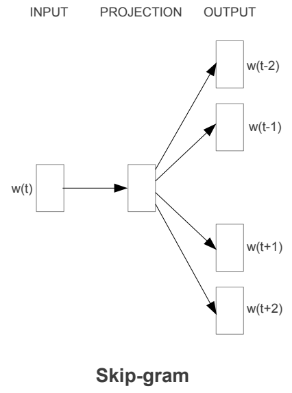

# Word2Vec in Keras

A Keras implementation of [word2vec](https://arxiv.org/abs/1301.3781), specifically the continuous Skip-gram model for computing continuous vector representations of words from very large data sets. The quality of the word vectors is measured in a word similarity task, with word2vec showing a large improvement in accuracy at a much lower computational cost. Further, word2vec performs at state-of-the-art accuracy for measuring  syntactic and semantic word similarities.

## Model architecture

 

## Reference

Mikolov, Tomas, et al. "Efficient estimation of word representations in vector space." arXiv preprint arXiv:1301.3781 (2013). [https://arxiv.org/pdf/1301.3781.pdf](https://arxiv.org/pdf/1301.3781.pdf)

## Author

[@snehasinghania](https://github.com/snehasinghania)

Sneha Singhania

[@ni9elf](https://github.com/ni9elf)

Nigel Fernandez 
